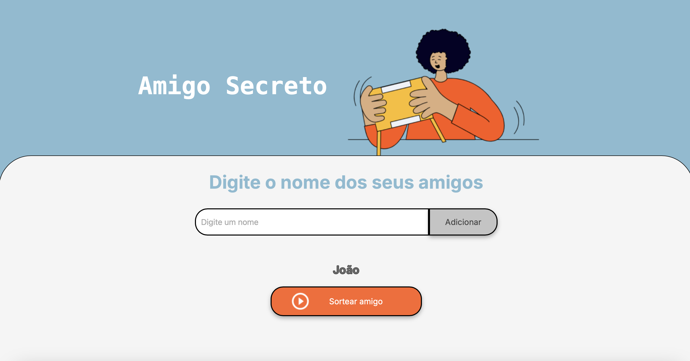
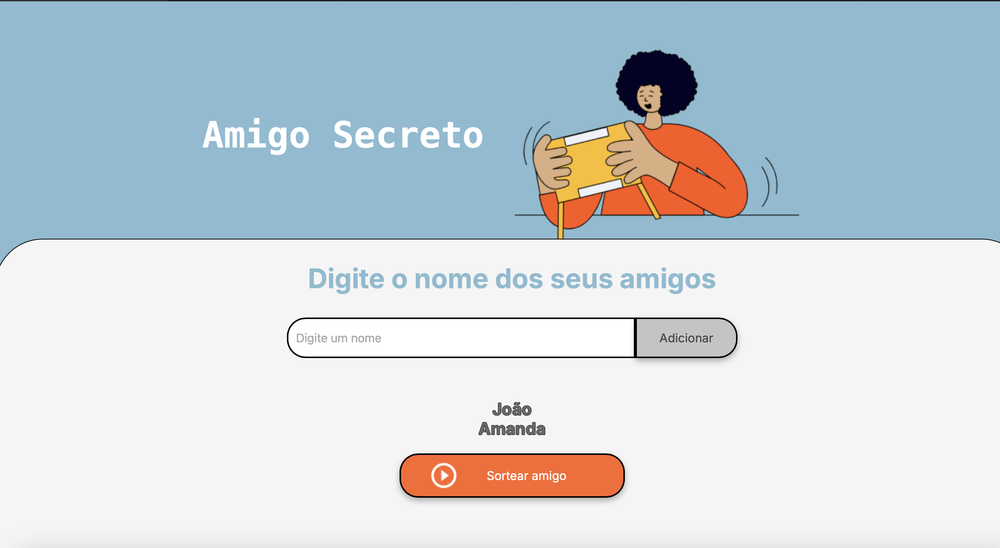
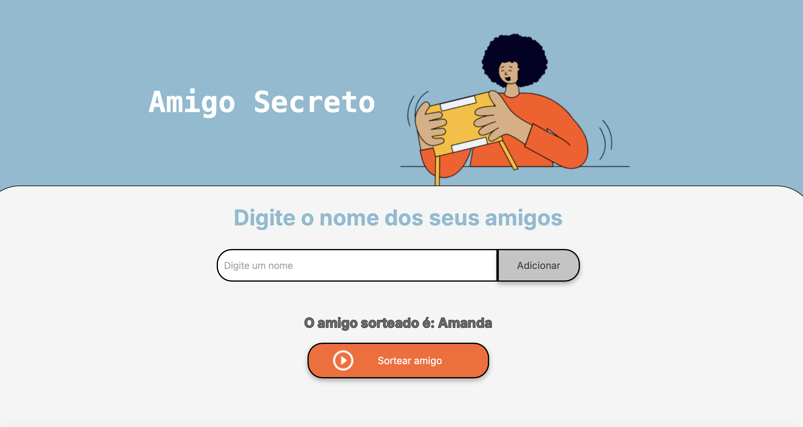

# Sorteio de Amigo Secreto

Este projeto foi desenvolvido a partir do challenge proposto no curso da ONE na plataforma [Alura](https://www.alura.com.br).

## Sobre o Projeto

O objetivo foi de criar um site onde é possível adicionar nomes de pessoas, e depois ser sorteado um 'amigo secreto'.

## Funcionalidade

- Adicionar nomes à lista.

- Exibir os nomes adicionados.

- Sortear os nomes aleatoriamente.

## Tecnologias Utilizadas

- HTML
- CSS
- JavaScript
